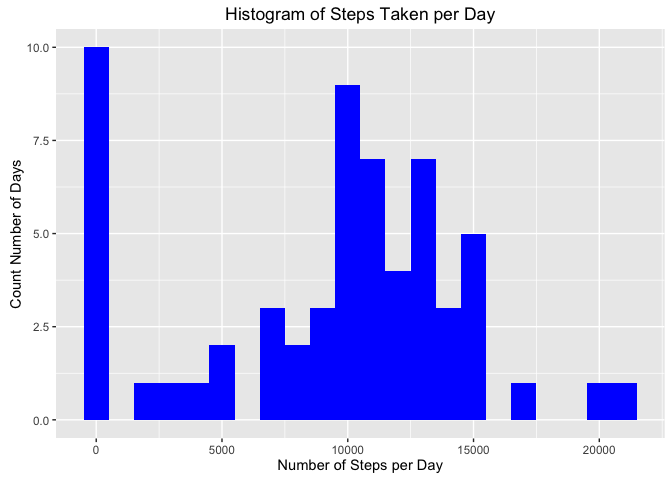
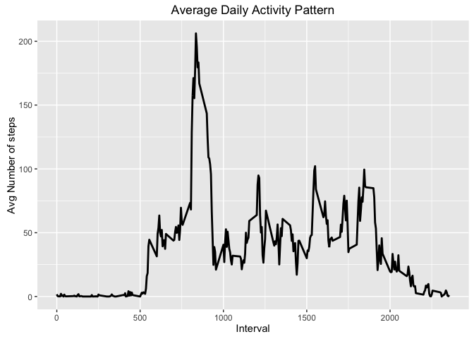
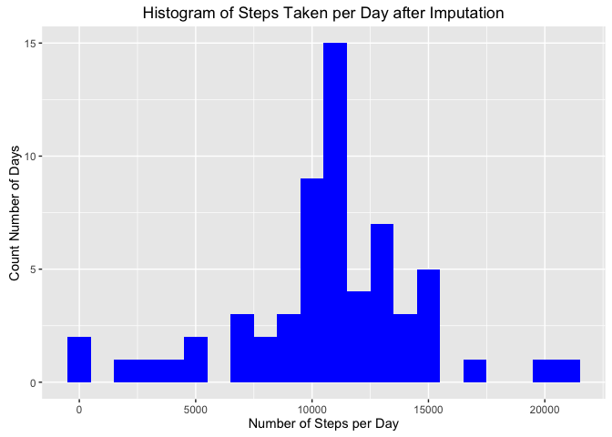
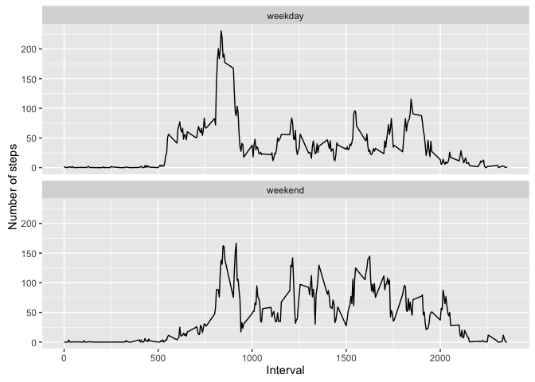

# Reproducible Research: Peer Assessment 1


## Loading and preprocessing the data

```r
unzip("activity.zip")
activity <- read.csv("~/Desktop/course_fei/Reprod/PA/RepData_PeerAssessment1/activity.csv")
str(activity)
```

```
## 'data.frame':	17568 obs. of  3 variables:
##  $ steps   : int  NA NA NA NA NA NA NA NA NA NA ...
##  $ date    : Factor w/ 61 levels "2012-10-01","2012-10-02",..: 1 1 1 1 1 1 1 1 1 1 ...
##  $ interval: int  0 5 10 15 20 25 30 35 40 45 ...
```


## What is mean total number of steps taken per day?

```r
###Calculate the total number of steps taken per day
TotalStepsByDay <- aggregate(activity$steps,list(date=activity$date),sum,na.rm=T)
str(TotalStepsByDay)
```

```
## 'data.frame':	61 obs. of  2 variables:
##  $ date: Factor w/ 61 levels "2012-10-01","2012-10-02",..: 1 2 3 4 5 6 7 8 9 10 ...
##  $ x   : int  0 126 11352 12116 13294 15420 11015 0 12811 9900 ...
```

```r
####Assgin column names 

colnames(TotalStepsByDay) <- c("date","Totsteps")
head(TotalStepsByDay)
```

```
##         date Totsteps
## 1 2012-10-01        0
## 2 2012-10-02      126
## 3 2012-10-03    11352
## 4 2012-10-04    12116
## 5 2012-10-05    13294
## 6 2012-10-06    15420
```

```r
####Create histogram 
library(ggplot2)
```

```
## Warning: package 'ggplot2' was built under R version 3.2.4
```

```r
ggplot(TotalStepsByDay, aes(x = Totsteps)) + 
        geom_histogram(fill = "blue", binwidth = 1000) + 
        labs(title="Histogram of Steps Taken per Day", 
             x = "Number of Steps per Day", y = "Count Number of Days")  
```



```r
#### Calculate and report the mean and median of the total number of steps taken per day
stepMean <- mean(TotalStepsByDay$Totsteps,na.rm=T)
print(paste("The Mean of the total number of steps taken per day is",round(stepMean,2)))
```

```
## [1] "The Mean of the total number of steps taken per day is 9354.23"
```

```r
stepMedian <- median(TotalStepsByDay$Totsteps,na.rm=TRUE)
print(paste("The Median of the total number of steps taken per day is",round(stepMedian,2)))
```

```
## [1] "The Median of the total number of steps taken per day is 10395"
```


## What is the average daily activity pattern?

```r
####Make a time series plot (i.e. 𝚝𝚢𝚙𝚎 = "𝚕") of the 5-minute interval (x-axis) and the average number of steps taken, averaged across all days (y-axis)

StepsByInterval <- aggregate(activity$steps,list(interval=activity$interval),FUN = mean,na.rm=T)
str(StepsByInterval)
```

```
## 'data.frame':	288 obs. of  2 variables:
##  $ interval: int  0 5 10 15 20 25 30 35 40 45 ...
##  $ x       : num  1.717 0.3396 0.1321 0.1509 0.0755 ...
```

```r
ggplot(StepsByInterval, aes(x=interval, y=x)) +   
        geom_line(color="black", size=1) +  
        labs(title="Average Daily Activity Pattern", x="Interval", y="Avg Number of steps") 
```



```r
###Which 5-minute interval, on average across all the days in the dataset, contains the maximum number of steps?
max(StepsByInterval$x)
```

```
## [1] 206.1698
```

```r
StepsByInterval$interval[which.max(StepsByInterval$x)]
```

```
## [1] 835
```


## Imputing missing values

```r
####Calculate and report the total number of missing values in the dataset 

sum(is.na(activity))
```

```
## [1] 2304
```

```r
####use mean steps for the same 5 min interval 

#### Merge original datasets and the average steps per interval catagory 
activity2<- merge (activity, StepsByInterval, by = "interval", all.x=TRUE)
activity2<- activity2[order(activity2$date,activity2$interval),]
####create a new column do the imputation 
activity2$imputsteps<-ifelse(is.na(activity2$steps),activity2$x,activity2$steps)
sum(is.na(activity2$imputsteps))
```

```
## [1] 0
```

```r
####Make a histogram of the total number of steps taken each day and Calculate and report the mean and median total number of steps taken per day. Do these values differ from the estimates from the first part of the assignment? What is the impact of imputing missing data on the estimates of the total daily number of steps?

####Create histogram 
TotalStepsByDayIM <- aggregate(activity2$imputsteps,list(date=activity$date),sum,na.rm=T)
str(TotalStepsByDayIM)
```

```
## 'data.frame':	61 obs. of  2 variables:
##  $ date: Factor w/ 61 levels "2012-10-01","2012-10-02",..: 1 2 3 4 5 6 7 8 9 10 ...
##  $ x   : num  10766 126 11352 12116 13294 ...
```

```r
colnames(TotalStepsByDayIM) <- c("date","Totsteps")
ggplot(TotalStepsByDayIM, aes(x = Totsteps)) + 
        geom_histogram(fill = "blue", binwidth = 1000) + 
        labs(title="Histogram of Steps Taken per Day after Imputation", 
             x = "Number of Steps per Day", y = "Count Number of Days")  
```



```r
#### Calculate and report the mean and median of the total number of steps taken per day
stepMeanIM <- mean(TotalStepsByDayIM$Totsteps,na.rm=T)
print(paste("The Mean of the total number of steps taken per day is",round(stepMeanIM,2)))
```

```
## [1] "The Mean of the total number of steps taken per day is 10766.19"
```

```r
stepMedianIM <- median(TotalStepsByDayIM$Totsteps,na.rm=T)
print(paste("The Median of the total number of steps taken per day is",round(stepMedianIM,2)))
```

```
## [1] "The Median of the total number of steps taken per day is 10766.19"
```
The mean and median are different after imputation 


## Are there differences in activity patterns between weekdays and weekends?

```r
#### assgin type to date 
daytype <- function(date) {
        if (weekdays(as.Date(date)) %in% c("Saturday", "Sunday")) {
                "weekend"
        } else {
                "weekday"
        }
}
activity2$daytype <- as.factor(sapply(activity2$date, daytype))
#### get average steps per interval for each type
steps_weekday<- aggregate(imputsteps~ interval, data = activity2, 
                             subset=activity2$daytype=="weekday", FUN = mean)
steps_weekday$daytype <- rep("weekday", nrow(steps_weekday))

steps_weekend<- aggregate(imputsteps~ interval, data = activity2, 
                          subset=activity2$daytype=="weekend", FUN = mean)
steps_weekend$daytype <- rep("weekend", nrow(steps_weekend))


#### combine data
steps_all<-rbind(steps_weekday, steps_weekend)
steps_all$daytype<- as.factor(steps_all$daytype)
 
        
        
ggplot(steps_all, aes(x=interval, y=imputsteps)) + 
        geom_line(color="black") + 
        facet_wrap(~ daytype, nrow=2, ncol=1) +
        labs(x="Interval", y="Number of steps") 
```



